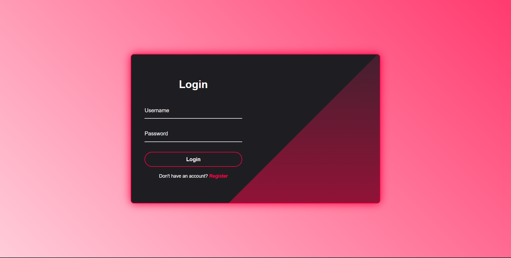

# Gen-Web-Site

Stylish General Web-site for Login &amp; Registration , but not loginable.

# 🔐 Elegant Login & Registration Pages

A beautifully crafted, modern, and interactive Auth interface made with ❤️. Features smooth transitions, input validations, and fully responsive layouts.

---

## 📊 Project Stats


---

## 🏷️ Version


---

## 🚀 Live Demo

[](https://chiragsinh02004.github.io/Gen-Web-Site/)

)

🔗 **View the website:** https://chiragsinh02004.github.io/Gen-Web-Site/

---

## ✨ Features

- 🌓 **Smooth Sliding Transition:** Seamless toggle between Login and Registration forms.
- 🎨 **Modern UI/UX:** Clean typography, glassmorphism effects, and vibrant gradients.
- ⚡ **Interactive Inputs:** Floating labels, custom focus rings, and real-time hover states.
- 🛡️ **Client-Side Validation:** Form inputs pre-configured with HTML5 validation constraints.
- 📱 **Fully Responsive:** Optimised for desktop, tablets, and mobile screens.
- 🌐 **Lightweight & Fast:** Zero dependencies, built purely with native web technologies.

---

## 🛠️ Tech Stack

- **HTML5:** Semantic markup, structure, and native form validation.
- **CSS3:** Custom properties (variables), Flexbox/Grid, Keyframe animations, and Transitions.

---

## ⚙️ How to Use Locally

1. **Clone the repository:**
   ```bash
   git clone https://chiragsinh02004.github.io/Gen-Web-Site/
   ```
2. **Navigate to the project folder:**
   ```bash
   cd Gen-Web-Site
   ```
3. **Open the project:**
   Simply double-click `index.html` to view it in your browser.

---

## 📜 License

This project is licensed under the **MIT License**. Feel free to use, customize, and integrate it into your own applications.

---

## 🙌 Developer

- **[Parmar_Chirag_Sinh](https://github.com)** - Developer & Designer

